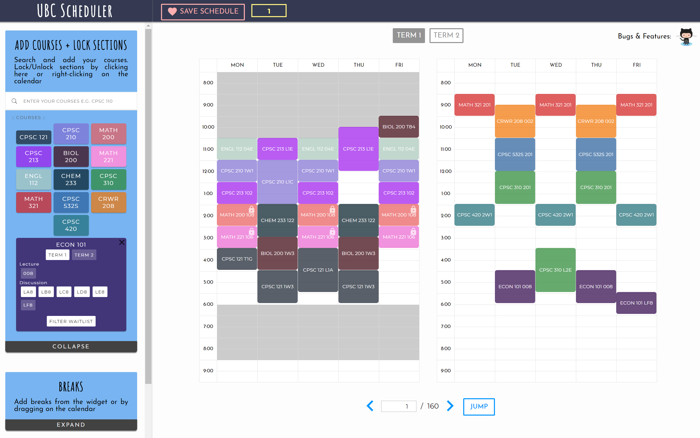

# UBC Scheduler
A course scheduler for UBC. Check out the site at <https://www.ubcscheduler.com> <br/>
Built in collaboration with https://github.com/shade

## Contents
  - [UBC Scheduler](#ubc-scheduler)
- [Features](#features)
- [Installation](#installation)
- [How it's built](#api)
  * [API](#api)
  * [Client](#client)
    + [store](#store)
    + [reducers](#reducers)
    + [actions](#actions)
	+ [components](#components)
    + [css](#css)
    + [jS](#js)
      - [_design_](#-design-)
      - [_design_](#-design--1)
- [Scheduling](#scheduling)
  * [Locking sections](#locking-sections)
  * [Adding breaks](#adding-breaks)
- [Production](#production)

# Features
A major design goal for this scheduler is real-time feedback. Before, when scheduling happens in stages (user adds courses, adds breaks, locks sections etc) and then schedules, it was very different to find out which courses collude or what exactly caused no schedules to be found. By scheduling in real time and alerting users in real time, users can pinpoint which action was the problem. 

-   Schedule both terms at the same time    
-   Visualize sections by hovering and lock sections by clicking    
-   Add breaks by dragging or by a form    
-   Save schedules    
-   Create your custom courses (especially useful for Standard Timetables)    
-   Register sections by clicking on generated links    
-   Schedule in real-time whenever an action (adding a course, break, locking a section, etc...) is made




# Installation
1. ``` git clone https://github.com/chrisjmyoon/ubcscheduler ```
2. Install dependencies ```npm install ``` 
3. Run both the api server and client app by ``` node app.js ```
4. Run just the client app by ```npm start ```

### Setting up API Server

1. Install mongodb from ```https://docs.mongodb.com/manual/installation/```
2. Run mongodb
3. (Optional) in the api folder run ```node warmup.js``` to preload course/courselist from UBC


# How it's built

## API
I used [Express](https://expressjs.com/) to as my web server framework. 
The API listens for requests at the endpoints ```/api/v1/courselists``` and ```/api/v1/course/:courseCode``` from the client and returns the data from the database if a fresh copy no more than 12 hours old exists or from ubc ssc. 

```app.js``` uses ```api/router.js``` to handle requests made to the two endpoints. 

The router delegates how to handle the request to ```api/controller.js``` which queries the database for a _course_ object or _courselist_ object as defined by ```api/model.js```. 

If the data does not exist, ```api/scraper.js``` scrapes the data in xml form from <https://courses.students.ubc.ca/cs/servlets/SRVCourseSchedule?sessyr=2017&sesscd=W&output=5&req=4&dept=CPSC&course=221>

```api/rules.js``` stores helper functions to filter out sections that we are not interested in (for example, distance education courses with no times)

Once the data is scraped, ```api/writer.js``` writes to the database and the controller sends the data back to the client. 

#### _Design_
I prefer using an api versus client side scraping because of some performance benefits of having data pre-processed, less bandwidth, scalability to more features (such as scraping seats available), and security. 

At least until UBC enables cors or provides its own API, to fetch UBC websites, we need to use a cors proxy adding reliance and trust in that proxy. 

However, in the case that the api fails/crashes, the current client uses client side scraping as a backup in ```backupscraper.js``` Courselist involves fetching multiple pages, so as a backup, a prefetched courselist written directly in the code is used. 


## Client
*! Note that this was my first project using React and React-Redux, so I most likely broke many standards and patterns*

Built with React and React-Redux, App.js specifies the store (storing the state of our app) and components that compose our app. I used [create-react-app](https://github.com/facebook/create-react-app) to setup the project. I really liked https://www.youtube.com/watch?v=93p3LxR9xfM&t=1486s to understand react-redux. 

### store
The store uses ```thunk```, ```schedulerMiddleware```, and ```saveMiddleware```. 
- ```thunk``` allows us to write action creators to return functions instead of actions (which is super convenient)
- ```schedulerMiddleware``` intercepts all actions and determines whether or not we should reschedule. This makes it a lot easier for us to implement a scheduler without a 'schedule' button. 
- ```saveMiddleware``` saving needs data from all other reducers and their respective states, so we use a middleware to coordinate this

### reducers
The states in the store are defined and modified by reducers, ```courseReducer```, ```saveReducer```, ```scheduleReducer```, and ```sidepanelReducer```.

 - ```courseReducer``` stores 
	```javascript
	const  initialState  = {
		courselist: [],
		courses: [],
		tempSection: {}
	}
	``` 
	_courselist_ stores an array of course codes and descriptions used in the search panel
	_courses_ stores an aggregate of all the courses currently being scheduled
	_tempSection_ stores the section info that is rendered on the calendar when a mouse is hovered over a section
	
- ```saveReducer``` stores
	- _saves_ an array of save objects (created in saveMiddleware) which contain all the information to go back to a given point in history. schedules are not saved as they are large and can be rescheduled given the other data. This array is stored in ```window.localStorage``` so that saves will persist even after the browser is closed.
	```javascript
	const save  = {
		courses:  state.course.courses,
		index:  state.scheduler.index,
		term:  state.scheduler.term,
		breaks:  state.scheduler.breaks,
		lockedSections:  state.scheduler.lockedSections,
		customNumber:  state.scheduler.customNumber,
		id:  state.save.nextId,
		selected:  false
	}
	``` 
- ```scheduleReducer``` stores all the data required to schedule (so breaks and lockedSections), the current term that is to be rendered (when both terms don't fit) and navigated
	```javascript
	const save  = {
		schedules: {t1:[[]], t2:[[]]},
		index: {t1:  0, t2:  0},
		tempIndex:  0,
		term:  "t1",
		breaks: {
		"t1": [0,0,0,0,0],
		"t2": [0,0,0,0,0]
		},
		lockedSections: [],
		customNumber:  1
	}
	``` 
- ```panelReducer``` stores which panel is currently toggled

	### actions
- The types of actions are defined in ```actions/types.js```
```
* represent actions that trigger a reschedule
FETCH_COURSELIST - get courselist from api and update courseReducer
ADD_COURSE	- get course from api *
ADD_CUSTOM_COURSE - add a custom course *
REMOVE_COURSE  - remove a custom course *
TOGGLE_COURSE_TERM  - change a course to be scheduled in a different term *
ADD_TEMP - adds a section to scheduleReducer.tempSection 
REMOVE_TEMP - removes temp section in scheduleReducer
FILTER_WAITING_LIST - removes all sections with activity === 'Waiting List' *
TOGGLE_INSTRUCTION_WRAP  - Changes whether or not an activity wrap is active
TOGGLE_COURSE - Changes whether or not a course is active
JUMP_TO - go to a particular index in the current term (scheduleReducer.term)
TOGGLE_TERM - change scheduleReducer.term
UPDATE_BREAKS - modify the breakArray for a specific term *
TOGGLE_LOCK - toggles whether a section is locked *
SAVE_SCHEDULE - adds the current state to a save object
LOAD_SCHEDULE  - loads the state from a save object *
REMOVE_SAVE - removes a save object from saveReducer.saves
RESTORE_SAVES_FROM_LOCAL_STORAGE - called initially to load saves from localStorage
```
### components
Components uses state from store to render views and connects UI elements to actions. 
The way I understood them as is that they take in props (like arguments) and uses the props to define its state (like local variables).

Using BreakFrom.js as an example, 

```mapStateToProps``` maps the ```scheduleRecuer.breaks``` to be accessible as this.props in the component. So when scheduleReducer.breaks changes, BreakForm's this.props.breaks will also change, 
But in order to make that change cause the component to rerender,  we need to map the props to component states in ```getDerivedStateFromProps```

### css 
css files for a particular component is included in the component itself. 

### js
- ```backupScraper``` - contains getters to get course and courselist using client side scraping or loading courselist from a file
- ```breakDragHelper``` - coordinates propagating mouseevents from blockSections and table cells to facilitate dragging to add breaks
	#### _design_
	I found separating blockSections and table cells in the current way to be messy to add dragging to add breaks. I feel in the future, it will be worth rendering blockSection directly as tablecell elements
	
- ```colorManager``` - maps course codes (unique identifier) to colors
- ```courselist``` - stores prefetched courselist
- ```userAlerts``` - contains helper functions to alert users when something goes wrong (e.g. no schedules found when trying to add breaks or a course)
	#### _design_
	This was a major design goal for this scheduler. Before, when scheduling happens in stages (user adds courses, adds breaks, locks sections etc) and then schedules, it was very different to find out which courses collude or what exactly caused no schedules to be found. By scheduling in real time and alerting users in real time, users can pinpoint which action was the problem. 

- ```scheduler``` - contains the main scheduling algorithm


# Scheduling
We use a recursive depth-first-search scheduling algorithm.  

We first create an array containing arrays of sections for an activity type. As an optimization, we sort the array from the least number of sections in a course-activity type to greatest so that when a collusion is detected, we can truncate the largest branch (this has minimal benefits when we cap the number of schedules generated to 1000 so we don't do this in this iteration).

A valid schedule is a combination of one section from each activity type that do not conflict.  

Starting with an empty array, we try adding a section from an activity type. If there is a collision, we stop searching that particular path.  

A major optimization can be done by expressing schedules as an integer, where each bit correspond to 30 minute intervals starting from 8:00 to 10:00 (All UBC courses are in this domain, however, for other schools that may have smaller intervals, the same idea can be used where each bit represents a different interval).  

eg. 
10:00am - 11:00am, 4:00pm - 5:00pm => (0 0 0 0 0 0 0 0 0 0 0 0 0 0 0 0 1 1 0 0 0 0 0 0 0 0 1 1 0 0 0 0)<sub>2</sub>

9:00 am - 11:00 am, 1:00pm - 3:00pm=>  (0 0 0 0 0 0 0 0 0 0 0 0 0 0 0 0 0 0 1 1 1 1 0 0 0 0 1 1 1 1 0 0)<sub>2</sub>

The & of both is  (0 0 0 0 0 0 0 0 0 0 0 0 0 0 0 0 0 0 0 0 0 0 0 0 0 0 1 1 0 0 0 0) indicating there is a collusion


Corresponding to the valid times of the accumulated array of sections, we also recursively pass an accumulation of each day. Instead of checking if a section colludes with all the previously added sections, we just check with the aggregate.

The base case is when the accumulated array has a section from each course-activity type or when enough schedules have been generated. 

Trusting the natural recursion, we have our schedules.

## Locking sections

Locking sections is simple under our scheduling algorithm. When we create the array of sections by course-activity types, we removed all other sections except for the locked sections if the array contains a locked section.

## Adding breaks
When we add breaks, we simply start with a different initial value for our accumulator. 

Putting it all together:
```
function schedule(m, t, w, r, f, count, acc) {
	if a section in each course-activity is scheduled: 
		we have a valid schedule! add to validSchedules
	
	for each section in a course-activity:
		# Check if there is a collusion
		if (section.m & m  ||  section.t & t  ||  section.w & w  ||
			section.r &r  ||  section.f & f):
			collusion! skip
		else:
			combinedM = section.m | m
			combinedT = section.t | t
			combinedW = section.w | w
			combinedR = section.r | r
			combinedF = section.f | f
			acc.push(section)
			# Recursively schedule
			schedule(combinedM, combinedT, combinedW, combinedR, combinedF, count+1, acc)
			acc.pop()			
}
```

# Production
Because of the api server, I didn't opt for a app-as-as-service-thingy but used a virtual machine. 

1. Set up the virtual machine with a static ip running Ubuntu Server 18.04 with port 80 enabled
https://docs.microsoft.com/en-us/azure/virtual-machines/windows/quick-create-portal
2. Clone project repo into virtual machine
```git clone https://github.com/chrisjmyoon/ubcscheduler```
3. Build optimal production code
```sudo run npm build ```
4. Set up nginx:
https://medium.com/@utkarsh_verma/configure-nginx-as-a-web-server-and-reverse-proxy-for-nodejs-application-on-aws-ubuntu-16-04-server-872922e21d38
5. Install and run mongodb and run warmup script
	```
	node warmup.js
	```
6. Connect domain (Google Domains) to static ip
7. Use Cloudflare to provide SSL certificate (Getting the s in https for security as well as enabling protected browser capabilities such as webworkers)
8. pm2 start app.js to listen to the port defined in the nginx setup (I used 8080)